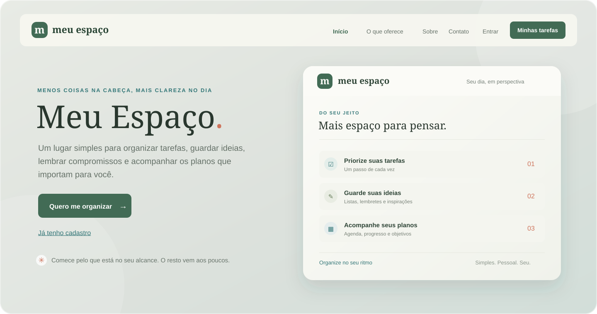
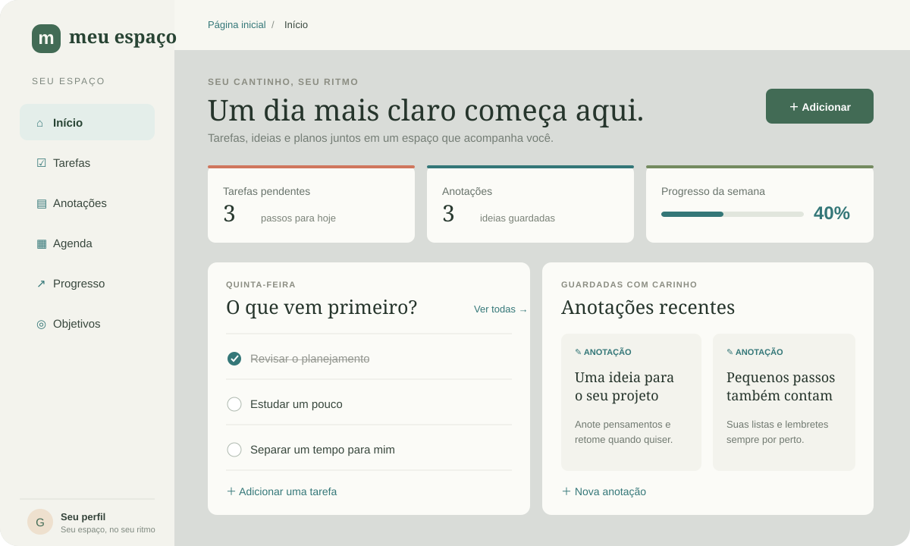

  

  <h1>Organize a vida com mais leveza.</h1>

  
Tarefas, ideias, compromissos e objetivos — em um espaço simples, pessoal e no seu ritmo.

  

    <strong>HTML5</strong>&nbsp; · &nbsp;<strong>CSS3</strong>&nbsp; · &nbsp;<strong>JavaScript</strong>&nbsp; · &nbsp;Sem dependências
  

 

  

 

  <a href="#recursos">Recursos</a>&nbsp; · &nbsp;
  <a href="#primeiros-passos">Primeiros passos</a>&nbsp; · &nbsp;
  <a href="#estrutura">Estrutura</a>&nbsp; · &nbsp;
  <a href="#dados-e-seguranca">Dados e segurança</a>

 

## Um só lugar para o que importa

O **Meu Espaço** é uma aplicação web de organização pessoal feita para reunir o que costuma ficar espalhado entre listas, lembretes e planos. A página inicial apresenta a proposta; no painel, cada pessoa pode cuidar de suas tarefas, guardar ideias, acompanhar compromissos e visualizar seus objetivos.

Com uma interface acolhedora e adaptável a diferentes telas, o projeto busca tornar a organização cotidiana mais clara sem acrescentar complexidade.

## Uma prévia do painel

  

 

## Recursos

| ✦ Planeje | ✎ Registre |
| --- | --- |
| Adicione, conclua, reabra, filtre, pesquise e exclua tarefas. | Guarde ideias, listas e lembretes em anotações pesquisáveis. |

| ▦ Acompanhe | ↗ Avance |
| --- | --- |
| Organize eventos e compromissos na agenda. | Veja o progresso das atividades e acompanhe objetivos pessoais. |

| ◉ Explore | ↔ Use onde estiver |
| --- | --- |
| Conheça o projeto e encontre atalhos de contato na página inicial. | Navegue pelo painel em computadores, tablets e celulares. |

O seletor deslizante de sol e lua alterna entre os temas claro e escuro, e mantém sua preferência neste navegador.

## Primeiros passos

O projeto é estático e não precisa de instalação ou dependências.

1. Baixe ou clone este repositório.
2. Abra a pasta no Visual Studio Code ou em outro editor.
3. Abra `index.html` no navegador — ou inicie o **Live Server**.
4. Use o cadastro de demonstração para acessar o painel.

## Tecnologias

`HTML5` &nbsp; `CSS3` &nbsp; `JavaScript` &nbsp; `localStorage` &nbsp; `sessionStorage`

## Estrutura do projeto

| Arquivo ou pasta | Descrição |
| --- | --- |
| `index.html` | Página inicial, apresentação e menus. |
| `cadastro.html` | Formulários de cadastro demonstrativo e entrada. |
| `login.html` | Atalho para a tela de entrada. |
| `tarefas.html` | Painel de organização pessoal. |
| `style.css` | Identidade visual e estilos responsivos. |
| `script.js` | Menus da página inicial e fluxos demonstrativos de acesso. |
| `tarefas.js` | Navegação, dados e interações do painel. |
| `assets/` | Logo e imagem de fundo utilizadas pelo site. |
| `.github/` | Ilustrações usadas neste README. |

## Dados e segurança

> **Demonstração de front-end:** não há servidor, banco de dados nem sincronização entre dispositivos. Os dados do painel são guardados no `localStorage` deste navegador, e o acesso de demonstração usa o `sessionStorage` da aba.
>
> O cadastro é demonstrativo e armazena credenciais localmente; **a senha fica em texto puro**. Use somente dados fictícios. Uma implantação real precisa de autenticação e armazenamento seguros no servidor.

 

  Feito para a vida real, no seu ritmo. ✳

